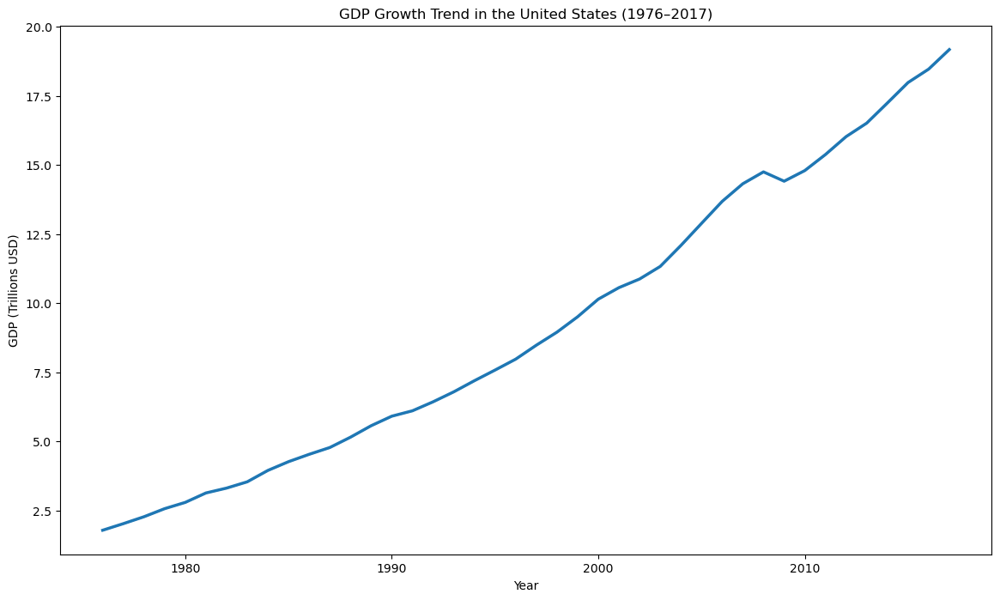
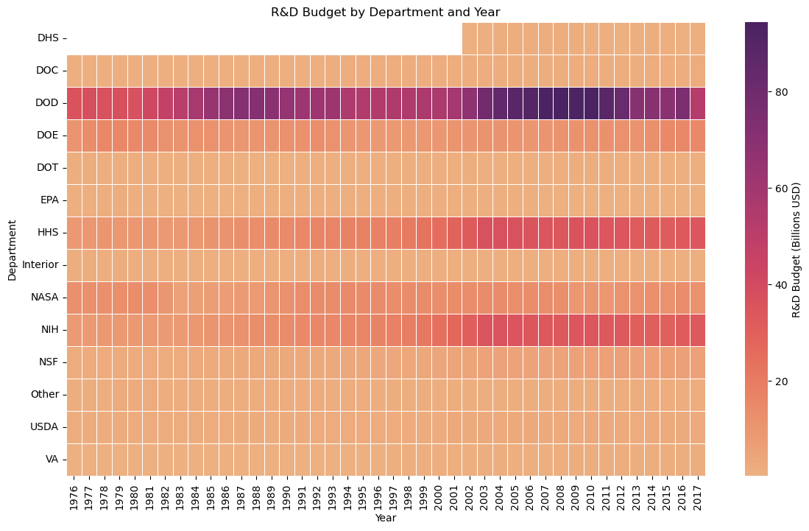
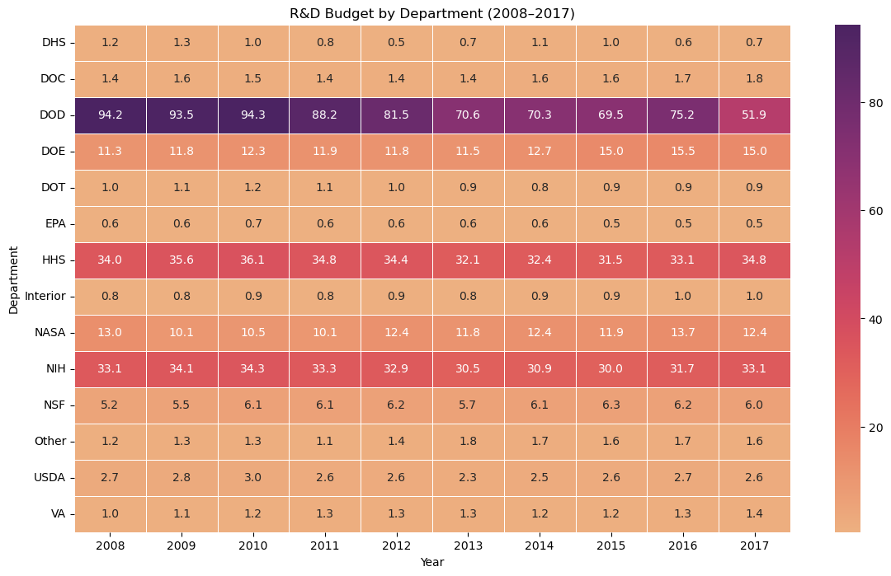

# 📊 Tidy Data Project: Federal R&D and GDP Analysis

## 📌 Project Overview

The goal of this project is to clean, transform and analyze U.S. federal department R&D spending and GDP data using tidy data principles. Tidy data ensures that each variable is stored in its own column, each observation forms its own row, and each type of observational unit is contained in a single table. 

By restructuring the dataset from a wide format into a long, tidy format, the data becomes easier to interpret.

## 🧹 Tidy Data Process
The dataset was cleaned and transformed using the following steps:
- Loaded the dataset using `pd.read_csv()`
- Reshaped the data from wide to long format using `pd.melt()`
- Split combined variables using `str.split()` to create separate columns for each variable
- Cleaned string values using `str.replace()` to remove unnecessary text
- Renamed columns for clarity
- Converted variables to numeric format using `pd.to_numeric()`
- Reordered columns to improve structure and readability

These steps ensure the dataset follows tidy data principles and is ready for analysis.

## Instructions

## 📂 Dataset Description
The dataset used in this project contains federal R&D budget data by department and year. The data was adapted from the following source:

- Federal R&D Budgets: [Download Data](data/fed_rd_year&gdp.csv)  
- Original Source (GitHub): [View Repository](https://github.com/rfordatascience/tidytuesday/tree/main/data/2019/2019-02-12)

The dataset includes the variables department, year, R&D budget, and GDP. It was cleaned and transformed using tidy data principles in order to get each variable in its own column.

### 🛠 Pre-processing
The dataset required several pre-processing steps to prepare it for analysis. These included reshaping the data from wide to long format using `pd.melt()`, splitting combined variables using `str.split()`, cleaning string values with `str.replace()`, renaming columns for clarity, and converting variables to numeric format. These steps ensured the data followed tidy data principles and was ready for analysis.

## 📚 References

- Tidy Data Paper: [Download PDF](references/tidy-data.pdf)  
- Pandas Cheat Sheet: [Download PDF](references/Pandas_Cheat_Sheet.pdf)

---

## 🖼️ Visual Examples

### 📈 GDP Trend Visualization
Shows the growth of U.S. GDP over time in trillions of dollars.

---

### 🔥 R&D Budget Heatmap (Full Timeline)
Displays R&D spending across departments and years.

---

### 🔍 R&D Budget Heatmap (Last 10 Years)
Highlights recent trends and short-term changes in spending.

---

## 💡 How to Use

1. **Navigate**: Use the sidebar to switch between different pages
2. **Filter**: Use dropdown menus and sliders to filter data by player, team, position, or week
3. **Search**: Use the search boxes in dataframe sections to find specific players or teams
4. **Compare**: On the Advanced Stats page, select 2 players and choose metrics to compare
5. **Analyze**: View interactive charts and tables to gain insights into player performance

## 👨‍💻 Author

**Tommy Santarelli**  
Business Analytics Major, University of Notre Dame

- LinkedIn: [Tommy Santarelli](https://www.linkedin.com/in/tommy-santarelli-792651329/)
- GitHub: [@tmsantar](https://github.com/tmsantar)
