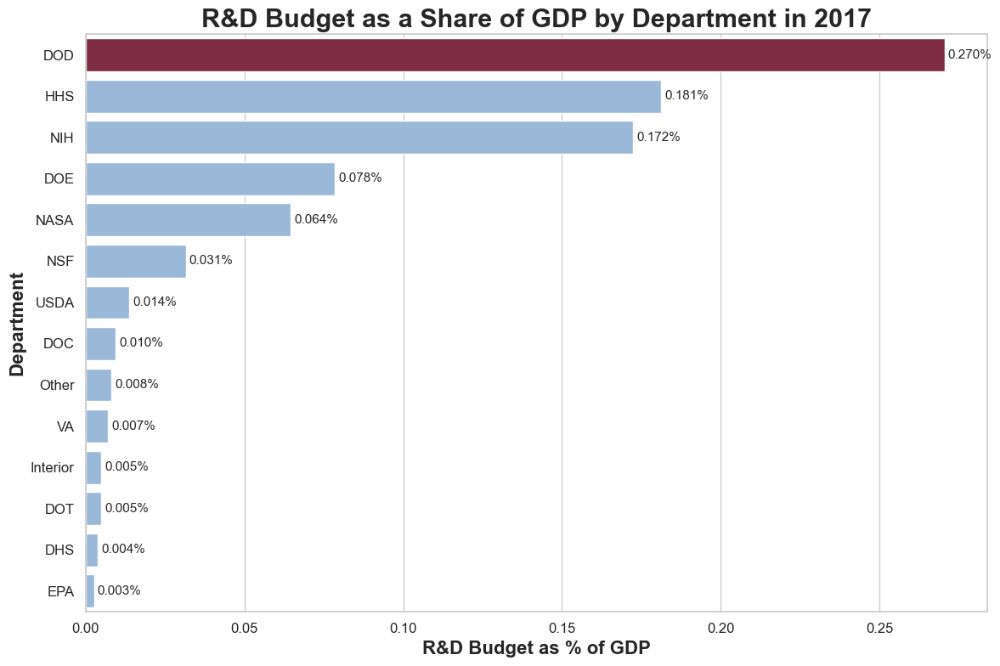

# 📊 Tidy Data Project: Federal R&D and GDP Analysis

Jupyter Notebook project that cleans, reshapes, and visualizes U.S. federal department R&D spending and GDP data using tidy data principles.

🔗 **Open the Notebook:** [main.ipynb](main.ipynb)

---

## 📌 Project Overview

This project takes a messy federal R&D budget dataset and transforms it into a cleaner, analysis-ready format. The original data stores multiple pieces of information together, making it difficult to compare departments, years, and GDP-related values directly.

The goal is to apply tidy data principles so that:

1. Each variable has its own column.
2. Each observation has its own row.
3. Each type of observational unit has its own table.

The final notebook focuses on how federal R&D funding changed over time, with special attention to the Department of Defense and how its spending compares with other major departments.

---

## 🧹 Tidy Data Process

The dataset was cleaned and transformed with the following steps:

- Loaded the original dataset with `pd.read_csv()`
- Reshaped the data from wide format to long format using `pd.melt()`
- Split the combined year/GDP field into separate variables using `str.split()`
- Removed extra text with `str.replace()`
- Renamed columns for clarity
- Converted columns to numeric format with `pd.to_numeric()`
- Reordered columns into a tidy structure
- Created visualizations to summarize department spending patterns

These steps produce a final table with one row per department-year observation and separate columns for `Department`, `Year`, `RD_Budget`, and `GDP`.

---

## 📂 Dataset Description

The dataset contains federal R&D budget data by department and year.

- Federal R&D Budgets: [Download Data](data/fed_rd_year&gdp.csv)
- Original Source: [TidyTuesday Federal R&D Data](https://github.com/rfordatascience/tidytuesday/tree/main/data/2019/2019-02-12)

---

## 📈 Analysis Questions

This project explores questions such as:

- Which federal departments received the most R&D funding over time?
- How did Department of Defense R&D spending compare with other departments?
- What share of total federal R&D spending went to the Department of Defense?
- How large was department R&D spending relative to GDP?

---

## 🖼️ Visual Examples

These screenshots show the main visual outputs from the notebook.

### 📈 DOD Compared with HHS and NIH

This line chart compares the Department of Defense with HHS and NIH, the two departments that come closest to it in later years. It highlights that DOD remained the largest federal R&D spender, while the gap narrowed over time.

<p align="center">
  
</p>

### 📊 DOD Share of the Federal R&D Budget

This chart shows how much of the total federal R&D budget was controlled by DOD each year. It adds context beyond raw spending by showing DOD's relative dominance within total federal R&D.

<p align="center">
  
</p>

### 📉 R&D Budget as a Share of GDP

This final comparison shows how large each department's R&D budget was relative to U.S. GDP in the most recent year of the dataset. It helps show where DOD stood compared with other departments once the size of the economy is taken into account.

<p align="center">
  
</p>

---

## 🚀 How to Run Locally

1. Open a terminal in the portfolio repository.
2. Move into the project folder:

```powershell
cd TidyData-Project
```

3. Install the required libraries:

```powershell
pip install pandas matplotlib seaborn jupyter
```

4. Launch Jupyter Notebook:

```powershell
jupyter notebook
```

5. Open `main.ipynb` and run the notebook cells in order.

You can also open [main.ipynb](main.ipynb) directly in VS Code and run the cells there.

---

## 📦 Required Libraries

These are the main libraries used in the notebook:

- `pandas`
- `matplotlib`
- `seaborn`
- `jupyter`

---

## 📚 References

- Tidy Data Paper: [Download PDF](references/tidy-data.pdf)
- Pandas Cheat Sheet: [Download PDF](references/Pandas_Cheat_Sheet.pdf)
- TidyTuesday Dataset: [Federal R&D Data](https://github.com/rfordatascience/tidytuesday/tree/main/data/2019/2019-02-12)

---

## 👨‍💻 Author

**Tommy Santarelli**  
Business Analytics Major, University of Notre Dame

- LinkedIn: [Tommy Santarelli](https://www.linkedin.com/in/tommy-santarelli-792651329/)
- GitHub: [@tmsantar](https://github.com/tmsantar)
