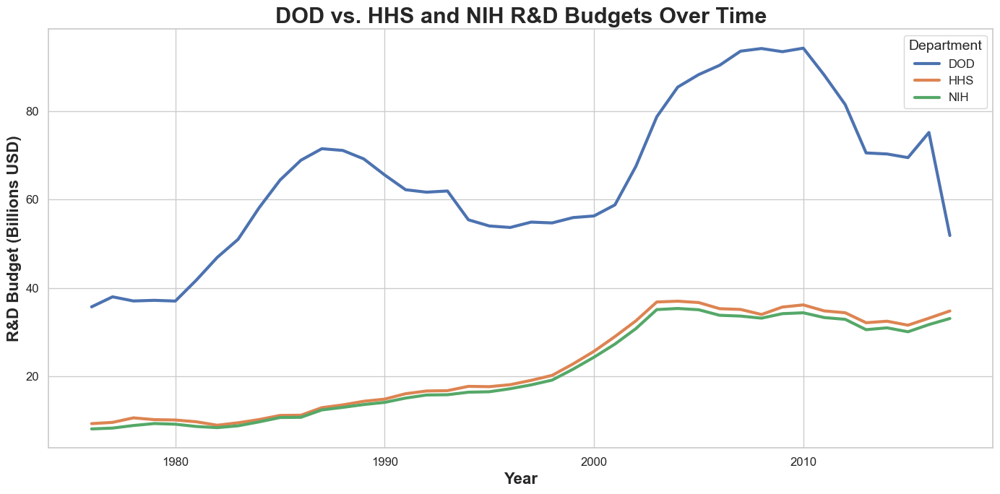
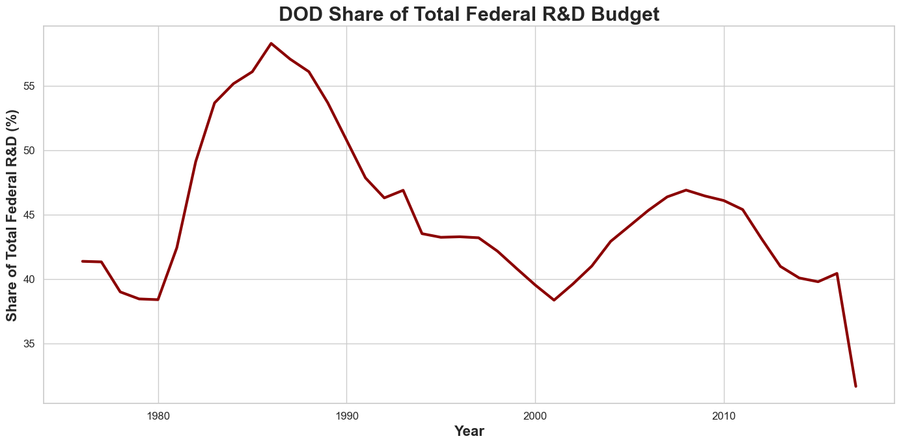

# Tidy Data Project: Federal R&D and GDP Analysis

## Project Overview

This project cleans, reshapes, and analyzes U.S. federal department R&D spending and GDP data using tidy data principles. The goal is to turn the original wide dataset into a structure where each variable has its own column, each observation has its own row, and the data is easier to summarize and visualize.

The final notebook focuses on how federal R&D funding changed over time, with special attention to the Department of Defense and how its spending compares with other major departments.

## Tidy Data Process

The dataset was cleaned and transformed with the following steps:

- Loaded the original dataset with `pd.read_csv()`
- Reshaped the data from wide to long format using `pd.melt()`
- Split the combined year/GDP field into separate variables using `str.split()`
- Removed extra text with `str.replace()`
- Renamed columns for clarity
- Converted variables to numeric format with `pd.to_numeric()`
- Reordered columns into a tidy structure

These steps produce a final table with one row per department-year observation and separate columns for `Department`, `Year`, `RD_Budget`, and `GDP`.

## Dataset Description

The dataset contains federal R&D budget data by department and year.

- Federal R&D Budgets: [Download Data](data/fed_rd_year&gdp.csv)
- Original Source (GitHub): [View Repository](https://github.com/rfordatascience/tidytuesday/tree/main/data/2019/2019-02-12)

## Pre-processing

The raw dataset stored both year and GDP information inside the original column names, so it required reshaping before analysis. Using tidy data principles made the dataset easier to filter, aggregate, and visualize.

## References

- Tidy Data Paper: [Download PDF](references/tidy-data.pdf)
- Pandas Cheat Sheet: [Download PDF](references/Pandas_Cheat_Sheet.pdf)

---

## Visual Examples

### DOD Compared with HHS and NIH

This line chart compares the Department of Defense with HHS and NIH, the two departments that come closest to it in later years. It highlights that DOD remained the largest federal R&D spender, while the gap narrowed over time.

---

### DOD Share of the Federal R&D Budget

This chart shows how much of the total federal R&D budget was controlled by DOD each year. It adds context beyond raw spending by showing DOD's relative dominance within total federal R&D.

---

### R&D Budget as a Share of GDP

This final comparison shows how large each department's R&D budget was relative to U.S. GDP in the most recent year of the dataset. It helps show where DOD stood compared with other departments once the size of the economy is taken into account.

---

## How to Use

1. Open [main.ipynb](main.ipynb).
2. Run the notebook cells in order to view the cleaning steps and updated visuals.
3. Review the final pivot table to compare average R&D budgets by department.

## Author

**Tommy Santarelli**  
Business Analytics Major, University of Notre Dame

- LinkedIn: [Tommy Santarelli](https://www.linkedin.com/in/tommy-santarelli-792651329/)
- GitHub: [@tmsantar](https://github.com/tmsantar)
