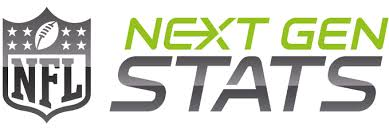

# NFL Receiving Stats Explorer 🏈

🔗 **Open the Live App:** [Click Here](http://10.24.199.63:8501)

An interactive Streamlit dashboard for exploring NFL receiving statistics from the 2025 regular season using Next Gen Stats tracking data.



## 📊 About This Application

This dashboard provides comprehensive analysis of NFL wide receiver and tight end performance using advanced tracking metrics. Next Gen Stats uses real-time location data captured by sensors throughout NFL stadiums, tracking player movements with precision down to inches on every play.

## ✨ Features

### 📈 Season Statistics
- View complete season statistics for all receivers and tight ends
- Filter top 10 performers by any statistical category
- Search and filter by player, team, or position
- Interactive bar charts showing league leaders

### 📅 Weekly Statistics  
- Analyze week-by-week performance across all 18 weeks
- Compare player performances in specific weeks
- Track consistency and trend patterns
- Filter by team and position for targeted analysis

### 🎯 Advanced Player Comparisons
- Compare up to 2 players side-by-side
- Interactive radar charts with true percentile rankings
- Customize which statistics to compare (3-7 metrics)
- Choose between season-long or weekly performance comparisons
- View detailed comparison tables with rounded statistics

## 📋 Available Statistics

### Basic Stats:
- **Yards**: Total receiving yards
- **Targets**: Number of times the player was targeted
- **Receptions**: Number of successful catches
- **Receiving Touchdowns**: Touchdowns scored from receptions
- **Catch Percentage**: Percentage of targets that resulted in catches

### Next Gen Advanced Metrics:
- **Avg Cushion**: Average distance (yards) between WR/TE and defender at snap
- **Avg Separation**: Average distance (yards) between WR/TE and nearest defender at catch
- **Avg Intended Air Yards**: Average air yards on all targets
- **Share of Intended Air Yards (%)**: Percentage of team's total intended air yards
- **Avg Yards After Catch**: Average yards gained after the catch
- **Avg Expected YAC**: Expected yards after catch based on tracking data
- **YAC Above Expectation**: Actual YAC compared to Expected YAC

## 📁 Project Structure

```
basic_streamlit_app/
├── main.py                     # Main home page
├── pages/                      # Multi-page app structure
│   ├── 1_📈_Season_Stats.py   # Season statistics page
│   ├── 2_📅_Weekly_Stats.py   # Weekly statistics page
│   └── 3_🎯_Advanced_Stats.py # Advanced player comparisons
├── data/                       # Dataset storage
    ├── nfl_data.py             # Dataset creation using nflreadpy package        
│   └── nextgen_receiving_stats.csv
├── images/                     # Images 
│   └── Next_Gen_Logo.jpg
└── README.md                   # This file
```

## 💡 How to Use

1. **Navigate**: Use the sidebar to switch between different pages
2. **Filter**: Use dropdown menus and sliders to filter data by player, team, position, or week
3. **Search**: Use the search boxes in dataframe sections to find specific players or teams
4. **Compare**: On the Advanced Stats page, select 2 players and choose metrics to compare
5. **Analyze**: View interactive charts and tables to gain insights into player performance

## 👨‍💻 Author

**Tommy Santarelli**  
Business Analytics Major, University of Notre Dame

- LinkedIn: [Tommy Santarelli](https://www.linkedin.com/in/tommy-santarelli-792651329/)
- GitHub: [@tmsantar](https://github.com/tmsantar)
