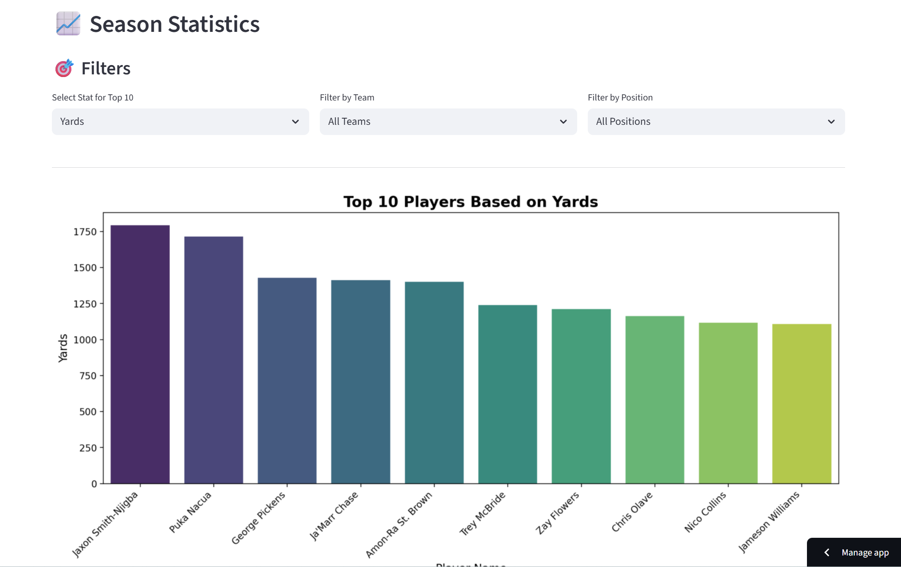
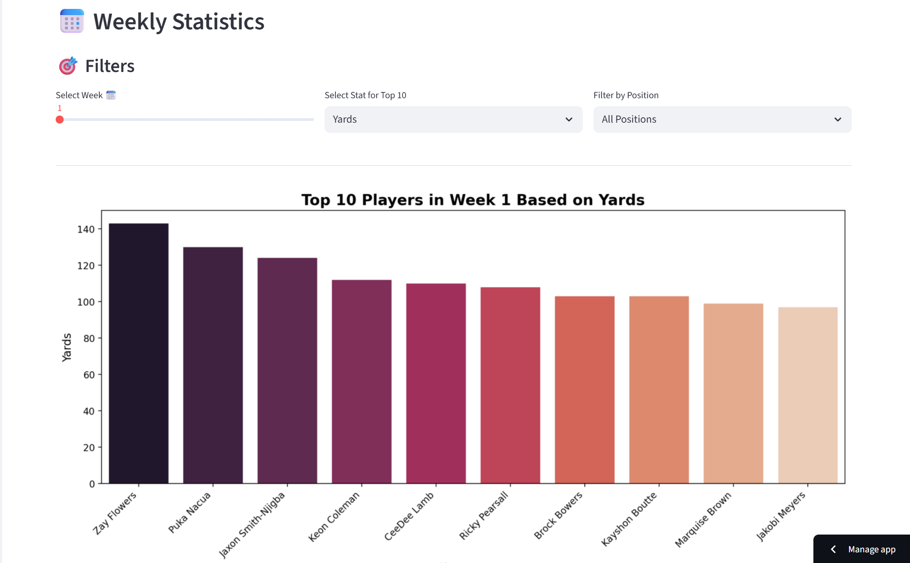
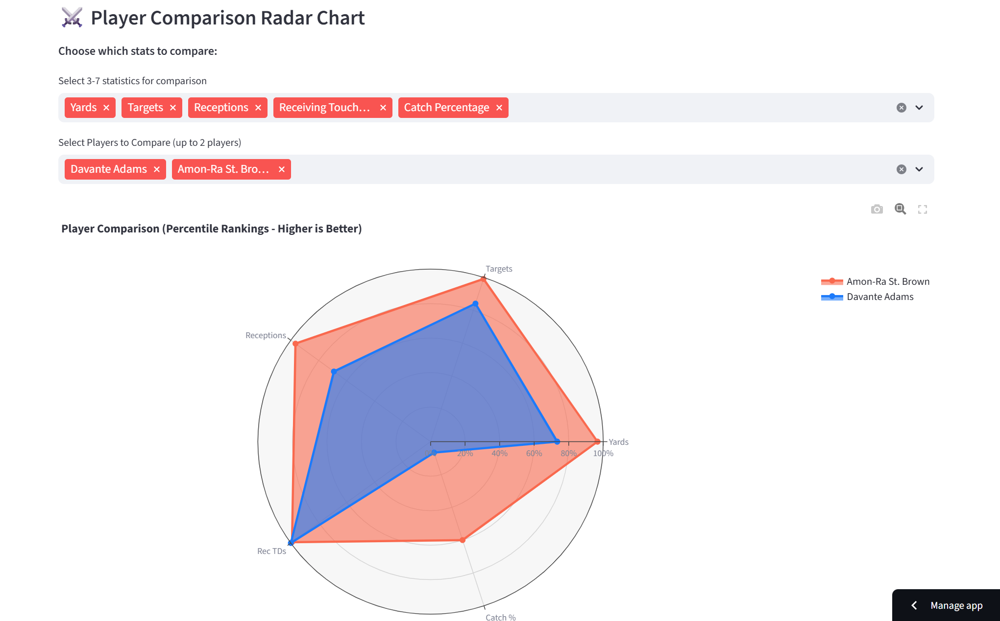
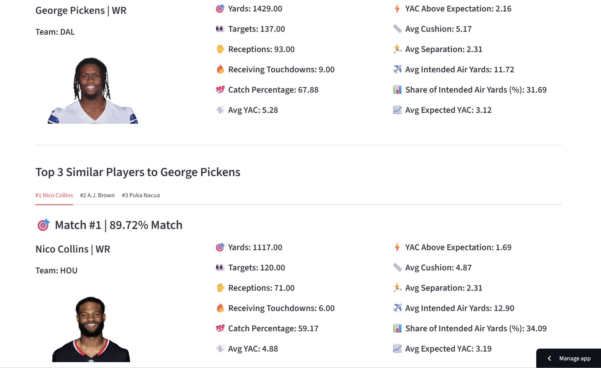

# NFL Receiving Stats Explorer 🏈

🔗 **Open the Live App:** [Click Here](https://santarelli-data-science-portfolio-k5rzpsrn6jbhxdv8udvkuq.streamlit.app/)

Interactive Streamlit dashboard for exploring NFL receiving statistics from the 2025 regular season using Next Gen Stats tracking data.

<p align="center">
  
</p>

---

## 📌 Project Overview

This project helps users explore wide receiver and tight end performance using advanced NFL tracking metrics. The app turns raw receiving data into an interactive dashboard where users can filter players, compare performance, view weekly trends, and find statistically similar players.

The dashboard is designed for sports analytics exploration. Instead of only showing traditional stats like yards and touchdowns, it also includes Next Gen Stats metrics such as separation, cushion, intended air yards, and yards after catch above expectation.

---

## ✨ Features

### 📈 Season Statistics

- View complete season statistics for NFL receivers and tight ends
- Filter top performers by any selected statistical category
- Search and filter by player, team, or position
- View interactive charts showing league leaders

### 📅 Weekly Statistics

- Analyze week-by-week receiving performance
- Compare player production across different weeks
- Filter weekly data by team, position, or player
- Explore consistency and performance trends over time

### 🎯 Advanced Player Comparisons

- Compare two players side by side
- Use radar charts to compare percentile-based performance profiles
- Choose custom metrics for comparison
- Switch between season-long and weekly performance views

### 🧬 Similar Player Tool

- Find the top three statistically similar receivers for a selected player
- Uses an unsupervised Nearest Neighbors model
- Standardizes player statistics before calculating similarity
- Displays match percentages, headshots, team information, and key metrics

---

## 📋 Available Statistics

### Basic Receiving Stats

- **Yards**: Total receiving yards
- **Targets**: Number of times the player was targeted
- **Receptions**: Number of completed catches
- **Receiving Touchdowns**: Touchdowns scored from receptions
- **Catch Percentage**: Percentage of targets that became catches

### Next Gen Advanced Metrics

- **Average Cushion**: Distance between the receiver and defender at the snap
- **Average Separation**: Distance between the receiver and nearest defender at the catch
- **Average Intended Air Yards**: Average depth of target
- **Share of Intended Air Yards**: Player share of team air yards
- **Average Yards After Catch**: Average yards gained after the reception
- **Expected YAC**: Expected yards after catch based on tracking data
- **YAC Above Expectation**: Actual yards after catch compared with expected yards after catch

---

## 🤖 Modeling Approach

The Similar Player Tool uses an unsupervised **Nearest Neighbors** model from scikit-learn. Player statistics are standardized with `StandardScaler`, then cosine distance is used to identify the closest statistical matches.

The app converts cosine distance into a readable match percentage so users can quickly understand how similar each player profile is.

---

## 🖼️ Visual Examples

These screenshots show the main pages and outputs in the deployed app.

### Season Stats

Users can explore season-long receiving leaders and filter by team, position, player, and metric.

<p align="center">
  
</p>

### Weekly Stats

The weekly page lets users focus on specific weeks and compare player production across the season.

<p align="center">
  
</p>

### Advanced Player Comparison

The comparison page uses radar charts and tables to show how two players compare across selected advanced metrics.

<p align="center">
  
</p>

### Similar Player Tool

The similar-player page identifies the closest statistical matches for a selected receiver using standardized performance metrics.

<p align="center">
  
</p>

---

## 🖼️ Data Enrichment

The dataset is enriched with player headshots by merging `player_headshots.csv` onto the Next Gen Stats data using **Player GSIS ID**. This allows the Similar Player Tool to display player images directly in the app.

---

## 💡 How to Use

1. **Navigate**: Use the sidebar to switch between pages.
2. **Filter**: Use dropdown menus and sliders to filter by player, team, position, week, or metric.
3. **Search**: Use search boxes to find specific players or teams.
4. **Compare**: Select two players on the Advanced Stats page to compare profiles.
5. **Match**: Choose a player in the Similar Player Tool to view the closest statistical matches.
6. **Analyze**: Use the charts, tables, and player profiles to understand receiving performance.

---

## 🚀 How to Run Locally

1. Open a terminal in the portfolio repository.
2. Move into the app folder:

```powershell
cd basic_streamlit_app
```

3. Install the required libraries:

```powershell
pip install -r requirements.txt
```

4. Run the app:

```powershell
streamlit run main.py
```

5. Open the local URL shown in the terminal, usually:

`http://localhost:8501`

---

## 📦 Required Libraries

These are the main libraries used by the app:

- `streamlit==1.53.0`
- `pandas>=1.4.0,<3.0.0`
- `matplotlib==3.10.8`
- `plotly==6.3.0`
- `scikit-learn==1.7.2`
- `seaborn==0.13.2`
- `nflreadpy==0.1.5`

---

## 👨‍💻 Author

**Tommy Santarelli**  
Business Analytics Major, University of Notre Dame

- LinkedIn: [Tommy Santarelli](https://www.linkedin.com/in/tommy-santarelli-792651329/)
- GitHub: [@tmsantar](https://github.com/tmsantar)
